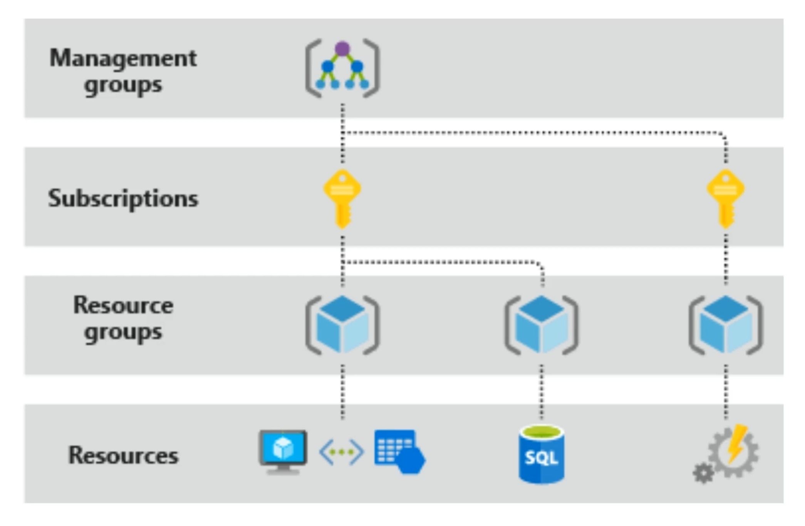
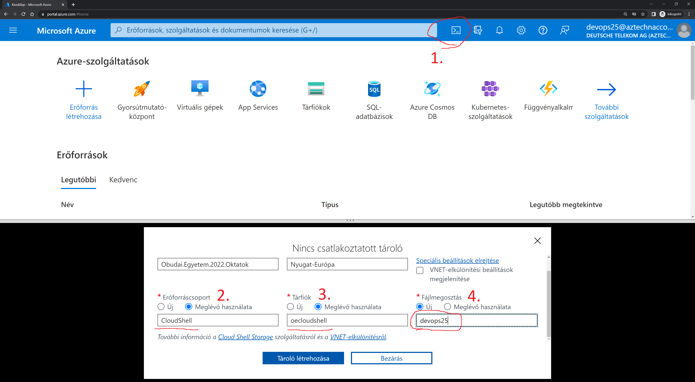

# Readme
This repository is used to play a bit around Azure and Azure Kubernetes Services. I demonstrate how to deploy VMs, Container Registry, Kubernetes Cluster, Containers, etc.
This is not a full training or learning material but rather a teaser into the Container and Azure world. It just give a feeling about Azure with some focus areas (especially containers).
The target is to have 3 hours of fun for the price of 1 or half bottle of beer (at Hungarian rate). Seriously, you will use my shared subscription so deploy carefully ;)

## Azure interface
In the below example we will use the [Azure Portal](https://portal.azure.com/) and the [Azure CLI](https://docs.microsoft.com/en-us/cli/azure/install-azure-cli?view=azure-cli-latest).

For Windows download the installer from here: [Azure CLI](https://aka.ms/installazurecliwindows)
No need to install it on the local machine as we will use a VM in the cloud for this activity.

Open [Azure Portal](https://portal.azure.com/) and log in to your account what you get earlier.

## Install our first VM
We need a VM which will build our container and push it into the Registry.
We will use this VM to deploy stuff in Azure too and to reach the AKS cluster.

1. On the home page click on **Create resource**. You can see **Categories** and some **Popular** options here. 
2. Click on **Ubuntu Server 20.04 LTS**. The VM creation blade comes up immediately.
3. At the **Resource group** click on the **Create new**. The name shall be **YOUR** username like "devops00"
4. Give a name at the **Virtual machine name**
5. For the **Region** select **West Europe**
6. **Availability options** shall be **No infrastructure redundancy required**
7. At the **Size**, select **Standard_B1s** (We don't need a powerful machine rather a cheap one is enough.)
8. For the **Authentication type** select **Password**
9. Give a **Username**
10. Give a **Password** and **Confirm password**. Hint: Password1234
11. The SSH port shall be allowed for inbound.
12. Click the **Next** button several times and go to the **Advanced** tab.
13. At the **Extensions** click on the **Select an extension to install**
14. Search for **Custom Script For Linux** and click on the tile and the **Next**.
15. Past the following to the **Command** field:
    ```
    curl -sL https://raw.githubusercontent.com/szasza576/oe-kubernetes/master/ubuntu2004-setup/tool-setup.sh | sudo bash
    ```
16. Click on **Create**.
17. Click on **Review + create**. The validation takes few seconds.
18. Click on **Create** and wait for the deployment.
The deployment takes ~5-10 minutes.

## Azure hierarchy
It looks like this:



More details here: https://docs.microsoft.com/en-us/azure/cloud-adoption-framework/ready/azure-setup-guide/organize-resources

## Setup cloud shell
To reach the freshly deployed VM we need an SSH client on our local machine or we can use the cloudshell as well. To activate and use cloudshell follow the below steps:

1. On the portal click on the "console" icon in the top right corner. This activates a web console at the bottom of the screen.
   1. Select **Bash** as environment
   2. Select **Show advanced settings**
2. At **Resource group** select **Use existing** and select **"CloudShell"**
3. At **Storage account** select **Use existing** and select **"oeloudshell"**
4. At **File share** select **Create new** and give your name or your username

[](./img/portal_console.png)

## Setup Azure CLI
After the VM deplyoment is done (check the bell icon in the top right corner) then let's login.
1. Open the VM's page by click on the bell icon and click on **Go to resource** or search the VM from the Home page.
2. Note the **Public IP address**
3. Connect via you favorite SSH client. Or connect via the cloudshell
4. Then login the Azure CLI.
   ```powershell
   az login
   ```
5. It will give a link and a code.
6. Open the link in your own browser and then enter the code.
7. Login with your account and then you can close the tab.

## Create a Container Registry
We need a Registry to store our containers. We could crete it on the portal but now we will use the Azure CLI.
1. To create the Registry we need the resource group's name and a name for the Registry itself. **ACR name shall be globally unique and lowercase.** Run these in Azure CLI. For easier management we use environment variables so we can copy-paste the comnmands.
   ```powershell
   ResourceGroup="<yourresourcegroupname>"
   ACRName="<youracrname>"
   az acr create --resource-group $ResourceGroup --name $ACRName --sku Basic
   ```
2. The deployment shall be done in few seconds.
3. You can also check the Registry in the portal.

## Create a Kubernetes Cluster
Note, this deployment takes the longest hence we start it as early.
We could run the container directly from the Registry without any K8s cluster but that wouldn't be fun enough. So let's create one.
1. Create a K8s cluster in Azure CLI
   ```powershell
   AKSName="<yourAKSname>"
   az aks create --resource-group $ResourceGroup --name $AKSName --node-count 1 --enable-addons monitoring --generate-ssh-keys --node-vm-size Standard_B2ms --enable-cluster-autoscaler --min-count 1 --max-count 3 --attach-acr $ACRName --load-balancer-sku Basic
   ```
This will take a while (about 10 minutes).


## Build a container
It's time to build the first container.
1. Open another SSH terminal to the VM if the AKS deployment is still running.
2. Pull artifacts from git.
   ```powershell
   git clone https://github.com/szasza576/oe-kubernetes
   ```
3. Build the first container (SSH)
   ```powershell
   docker build -t boy:latest ./oe-kubernetes/nginx/boy/
   ```
Hurray we have a container.

## Push the container into the ACR
We need to authenticate to the ACR and then we will push the image.
1. Login to the registry
   ```bash
   #ACRName="<youracrname>"
   az acr login --name $ACRName
   ```
2. Tag and push the image
   ```bash
   docker tag boy:latest $ACRName.azurecr.io/boy:latest
   docker push $ACRName.azurecr.io/boy:latest
   ```
5. On the portal search your **Container Registry**
6. In the left side menu click on the **Repositories**. And there you should see your new container.

## Build the second container
Diversity is number 1 so build a container for the girls too.
Instead of using a build VM we use the Registry's built in feature sourcing from the VM.
1. Start a build in Azure CLI
   ```powershell
   az acr build -r $ACRName ./oe-kubernetes/nginx/girl/ --platform linux -t girl:latest
   ```

## Build our third container
To Build our third container we will use the ACR's other feature which monitors the github and automatically build if changes happen.
1. On github create an [access token](https://github.com/settings/tokens) and create an environment variable. Add **repo:status** and **public_repo** access.
   ```powershell
   PAT="<token>"
   ```
1. Create a task in Azure CLI
   ```powershell
   az acr task create --registry $ACRName --name buildneutral --image neutral:latest --context https://github.com/szasza576/oe-kubernetes.git --file nginx/neutral/Dockerfile --git-access-token $PAT
   ```
2. Run the task manually
   ```powershell
   az acr task run --registry $ACRName --name buildneutral
   ```
3. You can see the build process
4. When the build is finished then go to the portal and check the Registry again
5. At the Registry check the **Tasks** submenu

## Deploy the containers on AKS
When the deployment is done then we can deploy our containers on AKS.

1. Get the credentials to the AKS.
   ```powershell
   az aks get-credentials --resource-group $ResourceGroup --name $AKSName
   ```
2. Check if it works
   ```powershell
   kubectl get nodes
   ```
3. Go to the manifest files
   ```powershell
   cd oe-kubernetes/k8s/
   ```
4. Edit the files and change the image name to your registry URI. Or just execute these commands:
   ```powershell
   sed -i s/"<youracr>"/$ACRName/g boy.yml
   sed -i s/"<youracr>"/$ACRName/g girl.yml
   sed -i s/"<youracr>"/$ACRName/g neutral.yml
   ```
5. Create the deployment for the boy
   ```powershell
   kubectl create -f boy.yml
   ```
6. Check if the deployment is done
   ```powershell
   kubectl get deployments
   kubectl get pods
   ```

## Expose the "boys" to internet
We need an external IP address and then create a loadbalancer based on that. We can use the portal for this task ... or just create the proper K8s Service which does it for us.

1. Create a publicly available K8s service
   ```powershell
   kubectl create -f service-boy-pub.yml
   ```
2. Check the service and wait until it gets a public IP address
   ```powershell
   kubectl get service -w
   ```
3. Test your fancy application from your browser. (Enter the IP as URL.)
4. Go back to the portal and check the fancy new IP address and the "kubernetes" loadbalancer


### Manual LB creation steps for masochists

1. Navigate to your own **Resource group**
2. On the resource group's blade click to **Add**
3. Search for **Public IP address** and click on it
4. Add a **Name** and **DNS** if you wish. DNS is optional but shall be globally unique.
5. Select **Static**
6. Click on **Create**
7. Wait for the deployment (about 1 minute) and then navigate to the resource
8. Note the IP address
9. Update the publicIP.yml with your **Resource group** and your **Public IP**

Now comes a tricky part. The pods needs to register to the loadbalancer hence AKS needs management (Contributor) access to the Resource group. We take the K8s own Service Principal and assign Contributor right to the Resource group.
11. Grant Contributor rights to AKS (in Azure CLI)
   ```powershell
   $AKS_AppID=$(az aks show --resource-group $ResourceGroup --name   $AKSName --query servicePrincipalProfile.clientId -o tsv)
   $ResourceGroup_scope=$(az group show --resource-group    $ResourceGroup --query id -o tsv)
   az role assignment create --assignee $AKS_AppID --role   "Contributor" --scope $ResourceGroup_scope
   ```
12. Check the AKS roles on the portal.
13. Refresh K8s credentials
   ```powershell
   az aks get-credentials --resource-group $ResourceGroup --name  $AKSName
   ```
14. Create the K8s Service
   ```powershell
   kubectl create -f .\publicIP.yml
   ```
15. Wait until it gets the external IP address. Sometimes the Role assignment takes several minute and until AKS has no right to register the IP address for the loadbalancer. After 2-5 minutes the rights are synched and it works.
   ```powershell
   kubectl get services
   kubectl describe service kids
   ```
16. Open the IP address (or the DNS) in a browser

## Deploy the second Deployment
Now deploy the girl container and let's see what happens.
1. Create the deployment for the girl
   ```powershell
   kubectl create -f girl.yml
   ```
2. Check if the deployment is done
   ```powershell
   kubectl get deployments
   kubectl get pods
   ```
3. Expose the service internally
   ```powershell
   kubectl create -f service-girl-ext.yml
   ```
4. Check the services
   ```powershell
   kubectl get service -w
   ```
5. This service got an IP address from the AKS' subnet and it could be reachable from other resources.

## Create a storage
The boys and girls are outdated as they have burnt in html page. The "neutral" is the future as it uses a volume.
1. Create a **Storage account** in Azure CLI
   ```powershell
   StorageAccountName="<yourstorageaccountname>"

   az storage account create --name $StorageAccountName  --resource-group $ResourceGroup --sku Standard_LRS --kind StorageV2
   ```
2. We need the connection point of the new Storage account
   ```powershell
   StorageConnection=$(az storage account show-connection-string --name $StorageAccountName --resource-group $ResourceGroup -o tsv)
   ```
3. Create an **Azure File Share**. Note, the name shall match with the one in the K8s deployment file.
   ```powershell
   FileShareName="neutral-html"
   az storage share create --name $FileShareName --connection-string    $StorageConnection --quota 5
   ```
4. You can check the file share on the Portal as well
5. Navigate to **Storage accounts**
6. Select your new **Storage Account**
7. Select **File shares** at the left menu
8. Select your **File Share**. Called **neutral-html**
9. Download the neutral's html locally from [the github](https://raw.githubusercontent.com/szasza576/oe-kubernetes/master/nginx/neutral/index.html)
10. Click on **Upload**
11. Browse the previously downloaded index.html
12. Click on **Upload**

## Connect K8s to the Storage account
Kubernetes needs an authentication token to the Storage.
1. Get the **Storage key**
   ```powershell
   StorageKey=$(az storage account keys list --resource-group $ResourceGroup --account-name $StorageAccountName --query "[0].value" -o tsv)
   ```
2. Create a K8s secret
   ```powershell
   kubectl create secret generic azure-secret --from-literal=azurestorageaccountname=$StorageAccountName --from-literal=azurestorageaccountkey=$StorageKey
   ```

## Deploy the third container
1. Create the deployment for the neutral
   ```powershell
   kubectl create -f neutral.yml
   ```
2. Check if the deployment is done
   ```powershell
   kubectl get deployments
   kubectl get pods
   ```

## Enable an addon in AKS
Ooooohh Noooo!!!! We forgot the ingress controller.

No worries. Instead of redeployment we just enable the addon.
   ```powershell
   az aks enable-addons --resource-group $ResourceGroup --name    $AKSName --addons http_application_routing
   ```

## Expose applications via Ingress Controller
Very typical case to use Ingress Controller. AKS provides a Basic IC for testing purposes and an advanced one with Application GW. We activated the Basic one earlier so let's use that one.

1. Create the internal services for the 
   ```powershell  
   kubectl create -f service-girl-int.yml
   kubectl create -f service-boy-int.yml
   kubectl create -f service-neutral-int.yml
   kubectl create -f service-random.yml
   ```
2. Create the ingress rules
   ```powershell
   kubectl create -f ingress-kids-path.yml
   ```
3. Get the IP address of the Basic IC
   ```powershell
   kubectl get services -n kube-system addon-http-application-routing-nginx-ingress
   ```
4. Test the different links
   - http://\<yourIP\>/boy
   - http://\<yourIP\>/girl
   - http://\<yourIP\>/neutral
   - http://\<yourIP\>/random

## Scale the cluster automatically
Let's increase the Deployment size and then see how it scales the nodes.
1. Edit the deployment file and change replica count from 1 to 5.
   ```powershell
   kubectl edit deployments boy
   kubectl edit deployments girl
   ```
2. Or just patch them like
   ```powershell
   kubectl patch deployments girl -p '{"spec": {"replicas":10}}'
   ```
3. Monitor the number of pods and the number of servers
   ```powershell
   kubectl get deployments
   kubectl get pods
   kubectl get nodes
   ```
4. Also navigate to your AKS resource on the portal and check the **Nodes pools**
5. At the AKS resource, also check the **Insight** and **Metrics** submenus
Hurray it works :) Now delete it :P

## Template
Before we would delete the deployment we make a template from the concept.
1. Navigate to your own **Resource group**
2. Select all **Resources** by clicking on the checkbox
3. Click on **Export template** on the blade's top menu
4. Click on **Add to library**
5. Give a **Name** and a short **Description**
6. Click on **Save**
Now we can clean up the deployment.

## Clean up
To clean up just delete the whole resource group. This will delete all the resources inside it.
1. Navigate to your own **Resource group**
2. On the top menu click on **Delete resource group**
3. You need to re-enter its Name.
4. Click on **Delete**
Removing everything will take a while. No need to wait for it.

## Redeploy from template
As we saved the template we can redeploy the concept with few clicks.
The only thing what the template didn't save is the managed identity. So we need to create another one.
1. Create a new **Resource group**. (If the previous is still under delete then use another name.)
2. Create a **Managed Identity** with the same name what you used earlier (it was myACRId in the example).
3. Search for **Templates** in the top search bar
4. Select your previously created template file
5. Click on **Deploy**
6. Select the right **Resource group**
7. You might change the default names. Hint, as the ACR needs unique name and the previous sandbox might be still under delete hence it is good idea to change that name.
8. Agree the terms at the bottom
9. Click on **Purchase**
You can see the deployment is on the way and new resources shall appear in the selected resource group.

## Final clean up
Don't forget to clean up your resource group to prevent extra charging.
Delete your resource group.
Hint, no need to wait the finish of the ongoing deployment. The resource group erase will terminate any ongoing creation.